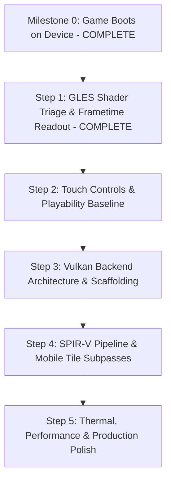

# Android Port Roadmap: GLES Stabilization & Vulkan Backend

**Branch:** `feature/android-vulkan-port`  
**Target:** OpenXRay on Android ARM64 (arm64-v8a)

---

## 1. Executive Summary & Flowchart

Having reached the milestone where OpenXRay boots on device, passes level loading, runs physics, and enters the game loop, this document defines the multi-phase engineering roadmap:

---

## 2. Step 1: GLES Shader Triage & Visibility Baseline (COMPLETE)

### 2.1 Objectives - ALL ACHIEVED
1. Add an on-screen frametime & FPS readout to accurately monitor render loop performance. [DONE]
2. Triage and fix pitch-black shaders and driver compile errors in `xrRenderPC_GL` on Android GLES 3.0 / ESSL. [DONE]
3. Establish a clear, verified visual baseline (terrain, props, sky, lighting, characters, HUD, rocks, vegetation) on-device before transitioning to Vulkan. [DONE]

### 2.2 Frametime Readout Implementation (Completed)
- **Files:** `src/xrEngine/Stats.cpp`, `src/xrEngine/defines.cpp`
- **Implementation:**
  - `CStats::OnRender()` enhanced: renders instantaneous and smoothed frametime in milliseconds (`Device.fTimeDeltaReal * 1000.0f`).
  - Output string: `%3d FPS (%.1f ms)` in bright yellow (`color_rgba(255, 255, 0, 255)`).
  - Anchored at `(x=260.0f, y=70.0f)` on Android to safely avoid camera hole-punch, notch, OS status icons, and minimap.
  - Enabled `rsShowFPS` by default in `psDeviceFlags` on Android.
- **Measured Device Performance (Sony Xperia XQ-DC54):**
  - Main Menu: **61 FPS (15.7 ms)**.
  - Level Load & Initialization: Smooth progress with 0 crashes.
  - In-Game Gameplay: Full simulation, physics, AI (11,072 objects), and rendering active.

### 2.3 Shader Triage & Fixes Applied (Completed)
- **GLSL ES 3.20 Strict Typing Sweep (All 444 Shaders):**
  - Qualcomm Adreno drivers strictly disallow implicit integer-to-float promotion (`vec3 * int`, `const float = int`). Replaced all integer literals with explicit floats (`* 2.0`, `float4(0.0)`, `minSamples = 5.0`, `float2(0.0, 0.0)`).
  - **Terrain & Static Surfaces:** Fixed `deffer_impl_flat.ps` (terrain) and `deffer_base_flat.ps` (tree bark / static geometry) which previously compiled with errors and fell back to pitch-black stubs.
  - **Billboard Tree LODs:** Fixed `lod.ps` integer vector arguments and float comparisons (`float2(0.0, 0.0)`, `float4(..., 0.0)`).
  - **Steep Parallax Mapping:** Fixed `sload.h` loop condition `for (int i=0; i<int(nNumSteps); ++i)` which previously halted compilation due to `<` comparing `int` with `float`.
  - **Lightplanes & Cobwebs:** Fixed `v_model_def_lplanes.h` and `model_def_lplanes.vs` interface mismatch where the vertex stage output `float3` while `p_lplanes.h` expected `float4`.
  - **Distortion / Glass:** Undefined unused `USE_SOFT_PARTICLES` in `particle_distort.ps` to eliminate missing `TEXCOORD1` varying mismatch with `model_distort4glass`.
- **Qualifier Normalization:**
  - Stripped redundant duplicate `layout(location = N) layout(location = N)` qualifiers across 45 IO struct headers in `res/gamedata/shaders/gl/iostructs/`.
- **FBO Diagnostic Logging:**
  - Added `glCheckFramebufferStatus` error reporting to Logcat (`OpenXRayRender`) in `gl_rendertarget_u_set_rt.cpp`.

---

## 3. Detailed Next Phase: Step 2 — Touch Controls, Input & Playability (Immediate Priority)

### 3.1 Objectives
1. Implement on-screen virtual touch controls so the game is fully playable without physical peripherals.
2. Enable dual virtual sticks:
   - **Left Stick:** Player movement (forward, backward, strafe left/right $\rightarrow$ `kFORWARD`, `kBACK`, `kL_STRAFE`, `kR_STRAFE`).
   - **Right Area / Stick:** Camera look / aim rotation (`IR_OnMouseMove(dx, dy)` delta feeding).
3. Implement primary action touch buttons:
   - **Fire / Attack:** `kWPN_FIRE` (mouse left button).
   - **Aim / Zoom:** `kWPN_ZOOM` (mouse right button).
   - **Jump:** `kJUMP`.
   - **Crouch:** `kCROUCH`.
   - **Use / Interact:** `kUSE` (pick up items, open doors, talk).
   - **Inventory / PDA:** `kINVENTORY`, `kACTIVE_JOBS`.
   - **Quick Access / Reload:** `kWPN_RELOAD`, `kQUICK_USE_1` - `kQUICK_USE_4`.
4. Bluetooth Gamepad Verification:
   - Verify SDL2 `SDL_GameController` mapping for external Bluetooth controllers (Xbox, DualShock/DualSense).

### 3.2 Technical Implementation Plan for Touch Controls
- **Input Pipeline:**
  - `src/xrEngine/xr_input.cpp`: OpenXRay handles input through `CInput` and `IInputReceiver`.
  - In Android SDL2, touch events generate `SDL_FINGERDOWN`, `SDL_FINGERUP`, and `SDL_FINGERMOTION`.
  - Current relative mouse look in `xr_input.cpp` relies on delta motion (`offs[0] += event.motion.xrel`). We will intercept touch finger events or integrate a lightweight touch overlay renderer that:
    1. Tracks active finger IDs for Left Zone (virtual movement stick) and Right Zone (look swipe).
    2. Sends corresponding engine action presses (`IR_OnKeyboardPress`, `IR_OnKeyboardRelease`) for movement and buttons.
    3. Translates swipe deltas into `IR_OnMouseMove(dx, dy)` for responsive camera rotation.
- **Touch HUD Overlay Rendering:**
  - Render translucent virtual controls using OpenXRay's built-in 2D UI system (`CUICustomItem` / `CUIStatic` or Direct/GL quad batching).
  - Automatically toggle visibility: hidden during full-screen inventory/PDA/menu, visible during active gameplay (`g_pGameLevel`).

---

## 4. Overview of Subsequent Steps (Steps 3 – 5)

### Step 3: Vulkan Architecture & Scaffolding (`xrRender_VK`)
- **Module Architecture:**
  - Scaffold `src/Layers/xrRenderVK` and `src/Layers/xrRenderPC_VK` conforming to the `IRender` interface.
- **Vulkan Core Initialization:**
  - SDL2 Vulkan window surface creation (`SDL_Vulkan_CreateSurface`).
  - Instance, physical device selection (favoring high-performance discrete/mobile discrete), logical device creation with required extensions.
  - Vulkan Memory Allocator (VMA) integration for high-performance memory management.
  - Swapchain setup with double/triple buffering and presentation modes (`VK_PRESENT_MODE_FIFO_KHR` / `VK_PRESENT_MODE_MAILBOX_KHR`).

### Step 4: SPIR-V Pipeline & Mobile Tile Subpasses
- **Shader Pipeline:**
  - Toolchain to compile DX11 HLSL (from `xrRenderPC_R4`) or GLSL to SPIR-V via `dxc -spirv` or `glslangValidator`.
  - Descriptor set layouts for uniform buffers, texture samplers, and storage buffers.
  - Pipeline State Object (PSO) caching mechanism.
- **Mobile Tile Subpasses (Zero-Bandwidth G-Buffer):**
  - Implement Vulkan RenderPass with subpasses (`GBuffer Pass` -> `Lighting Accumulation Subpass` -> `Combine Subpass`).
  - Use `VK_ATTACHMENT_LOAD_OP_DONT_CARE` / `VK_ATTACHMENT_STORE_OP_DONT_CARE` with `input attachments` to keep G-buffer in on-chip mobile GPU tile memory (Adreno / Mali Tile Memory), avoiding costly DRAM roundtrips.

### Step 5: Thermal, Performance & Production Polish
- Target 60 FPS / 30 FPS stable thermal profiles.
- Dynamic resolution scaling.
- Asset staging & fast streaming optimizations.
- Final APK packaging and release pipeline.
